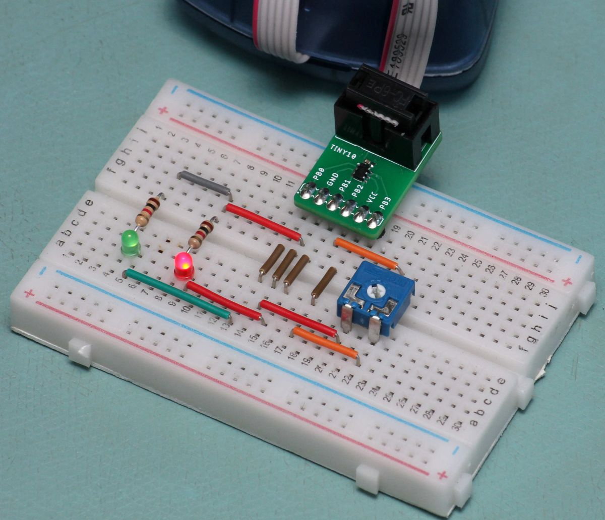

# ATTiny10 Playground

A collection of some firmware tests without any real hardware. 

Not all of them work, but there might be something helpful for you project.

## Notes
I use the Arduino IDE for all of my projects. You'll need to have the attiny10core installed to be able to use them:
https://github.com/technoblogy/attiny10core

But converting them to bare-metal c should be no problem.